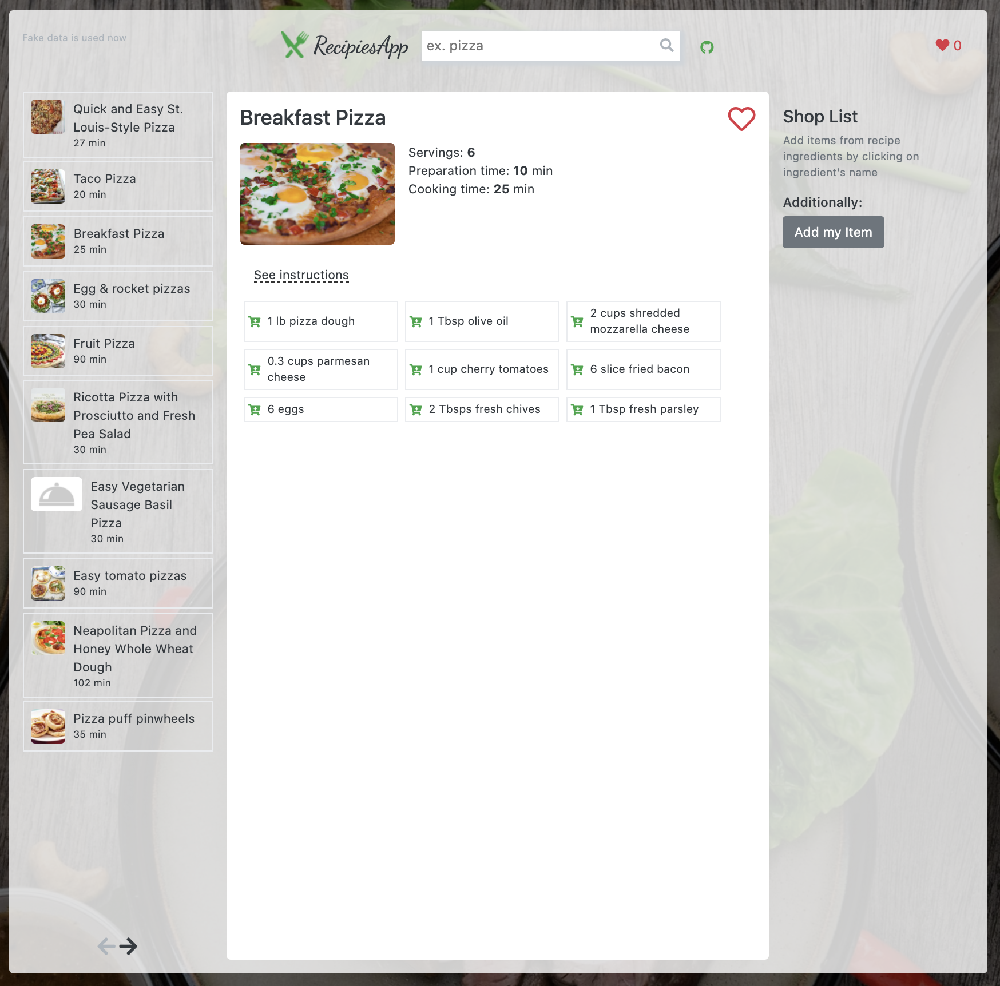
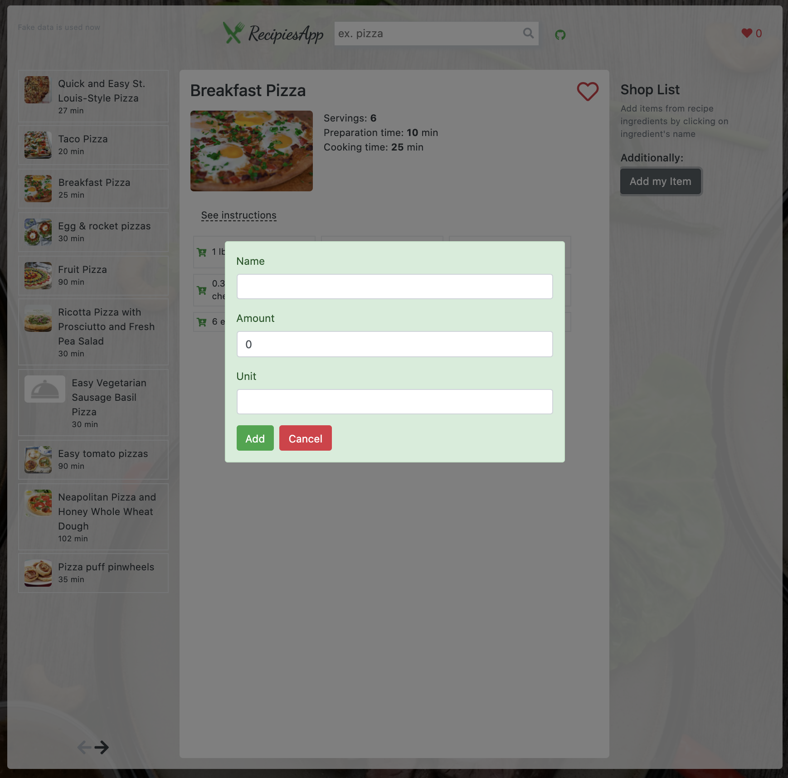
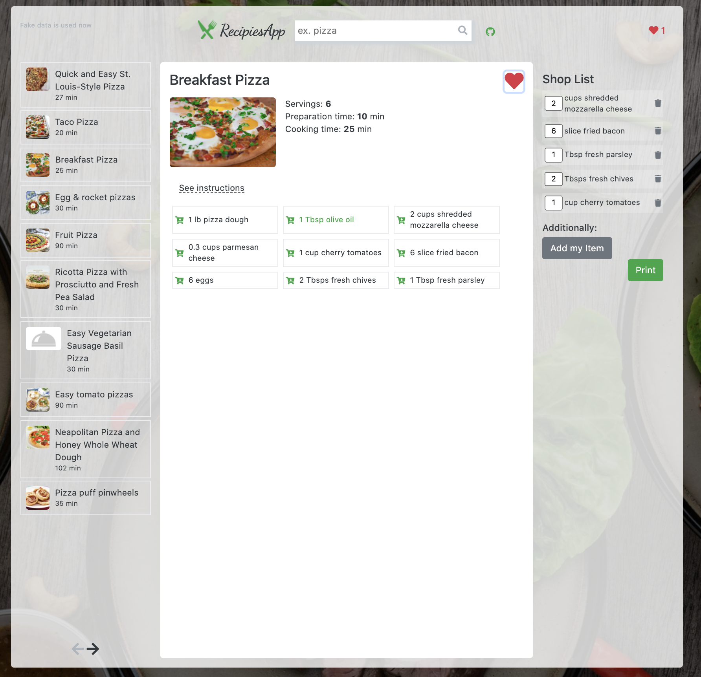
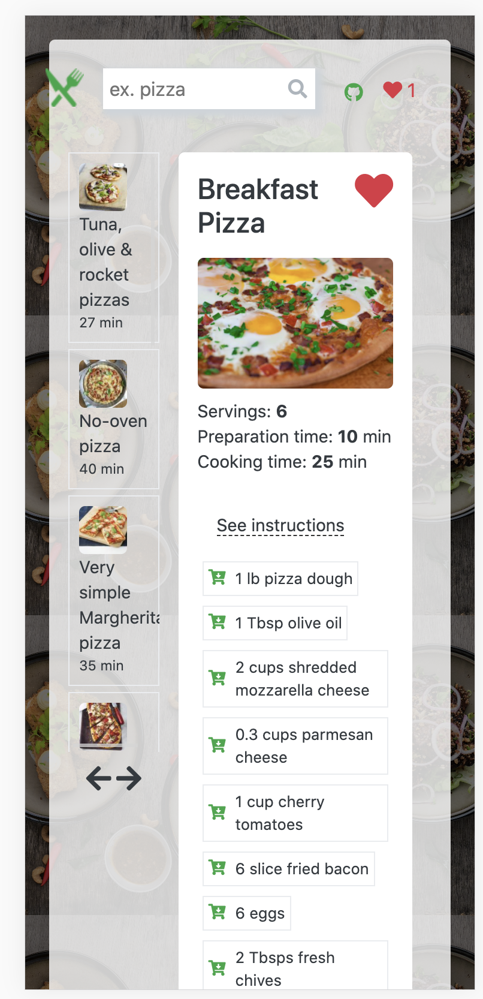
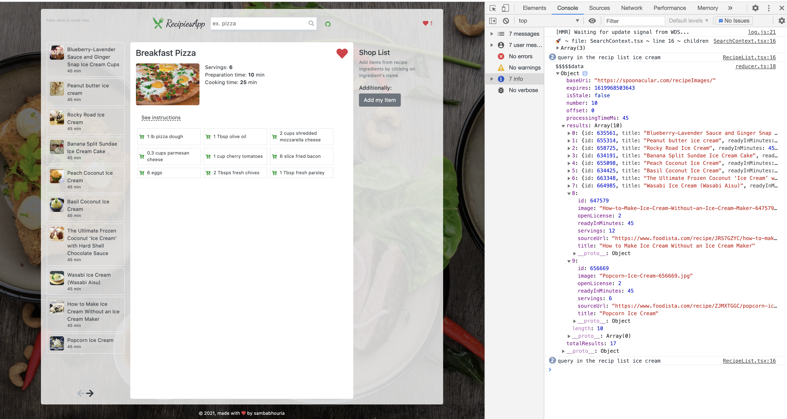
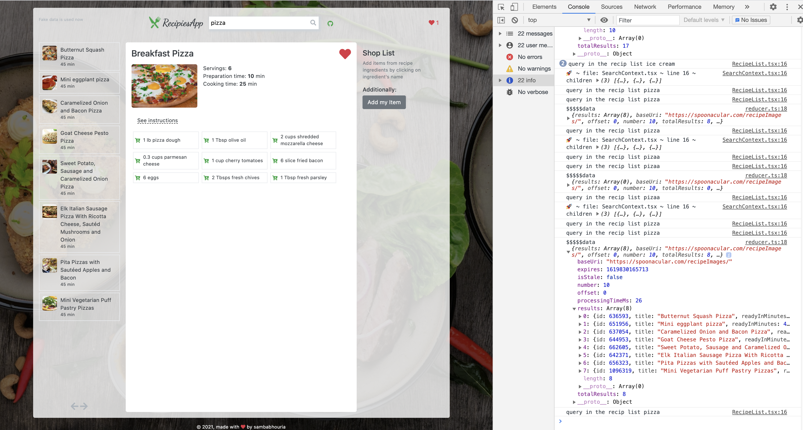

# Getting Started with Create React App

### `Demo here` https://recipes-application-heroku.herokuapp.com/

In the project directory, you can run:

### `yarn start`

In this project I use only functional components and React Hooks.

Used:

create-react-app;
typescript;
bootstrap + reactstrap;
redux-persistent;
redux-observable;
axios;
For tests:

jest
enzyme
redux-mock-store
Application allowes:

to search for recipies by keyword (using spoonacular API);
to view recipe details;
save recipes to Favourite List;
create editable shop list by choosing ingfredients from recipies;
add own items to shop list;
P.S. Due to restrictions of usage spoonacular API it is possible to have only 150 calls to their service per day, so in case if limit is reached fake data is used.
